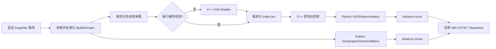

# MA-FSTSP 路网距离 H2H 按需查询改造实施计划

## 1. 文档状态

- 文档用途：作为后续实现、测试、验收和服务器迁移的施工依据。
- 当前状态：阶段 0 至阶段 5 已完成；阶段 6 的 H2H 正确性、接口、性能、缓存与 worker 验收已通过，但算法可行性验收发现既有 LRMP 缺少总航程约束，等待用户决定是否扩大范围修复；阶段 7 的安全脚本、报告格式和服务器流程已实施，实际 55k 构建/端到端报告仍需在 Linux 服务器执行。
- 目标项目：`MA-FSTSP-reproduce`。
- 目标大图：`datasets/nyc.graphml`，当前原始规模约为 54,128 个节点、142,123 条有向边。
- 本机 Python：`D:\Anaconda3\envs\MA-FSTSP\python.exe`。
- 本机 C++ 工具链目录：`D:\dev\mingw64\bin`。
- 本机资源：16 GB RAM；本机只承担小图/中图正确性验证，现阶段禁止调用、构建或求解 55k 图。
- 服务器资源：约 200 GB RAM，具备 C++ 编译器；Windows 构建产物不能直接复制到 Linux 使用，原生库需在服务器重新编译。

## 2. 已确认的设计决策

以下事项已经确认，后续实现不得擅自改变：

1. 为地图数据增加显式路径配置，目标 55k 图为 `datasets/nyc.graphml`。
2. 接受 C++ 原生 H2H 后端，Python 仅保留兼容层、构建调度、缓存管理和测试代码。
3. 保持当前项目的距离语义：
   - 路网标准化后，边权继续使用相邻节点坐标调用项目现有 `haversine` 函数所得的距离；
   - 不在本次改造中切换到 GraphML/OSM 原始 `length` 字段；
   - 无人机距离继续使用项目现有坐标距离公式；
   - 保持有向道路方向，不把路网改成无向图。
4. 本机只负责正确性验证。默认配置必须硬性禁止 `datasets/nyc.graphml` 这类 55k 图进入索引构建或算法求解；55k 构建与规模实验迁移到服务器执行。
5. H2H 索引只承担最短距离查询。首期不构建 shortest-path-neighbor 数组，不通过 H2H 恢复具体道路路径。
6. 后续算法继续使用原接口：

   `distance['truck'][u][v]`

   `distance['drone'][u][v]`

   不要求 `src/fstsp.py`、`src/lrmp.py`、`src/lp.py` 和 `src/hc_vns.py` 大范围改写。
7. 每次需要新增测试时，必须创建新的独立测试文件；不得把临时测试写入原有业务文件，也不得把 `experiments.py`、`problem.py` 或原有测试文件改造成新的测试入口。
8. Boston 规模验收按标准化后的最大强连通分量 8,313 个节点执行；8,412 是原始 GraphML 节点数。
9. 测试统一使用 Python 标准库 `unittest`，不为本次改造增加测试依赖。
10. H2H 索引缓存构建必须加入跨进程互斥锁，避免两个进程同时构建或写入同一索引文件。
11. 服务器已有 Gurobi 环境，服务器迁移不包含 Gurobi 安装工作。
12. 本地实施分支为 `260715h2hImplement`；用户验收前不上传 GitHub。

## 3. 背景与问题定义

### 3.1 当前数据初始化

当前 `problem.py::_pairwise_distance(graph)` 一次性构造：

- 卡车全节点对最短路字典；
- 无人机全节点对坐标距离字典。

其时间和空间复杂度均至少包含 \(O(n^2)\) 项。对于 54,128 个节点：

- 节点对数量约为 29.30 亿；
- 单个紧凑 `float64` 矩阵约为 23.4 GB；
- 卡车和无人机两个矩阵约为 46.9 GB；
- Python 嵌套字典在内存中的实际占用会明显高于紧凑矩阵。

现有原始规模 8,412 节点的 Boston 距离 pickle 已约 1.65 GB；后续算法验收使用标准化后的 8,313 节点最大强连通分量。这仍说明继续扩大全对矩阵不可行。

### 3.2 MA-FSTSP 中的距离访问方式

主算法的三个阶段都会查询卡车距离：

1. 阶段一：客户与仓库的集合化 MST 分组；
2. 阶段二：Set-TSP 候选集合间代价构造；
3. 阶段三：固定客户顺序后的卡车—无人机动态规划。

现有调用主要是双层下标读取，不依赖完整矩阵遍历、`items()`、`values()` 或 NumPy 整体转换。因此可以用“字典兼容的按需查询代理”替换真实矩阵。

### 3.3 不能采用的简单替代方案

不得将每次 `distance['truck'][u][v]` 直接替换成一次 NetworkX Dijkstra。原因是：

- 后续阶段可能产生数十万到数百万次重复或不同节点对查询；
- 单次按需 Dijkstra 虽然解决初始化内存问题，但会把瓶颈转移到求解阶段；
- 按源节点缓存完整 Dijkstra 行仍可能逐渐退化成 \(O(n^2)\) 内存。

因此生产方案采用 H2H 索引；按需 Dijkstra 仅作为调试或小图基准后端。

## 4. 改造目标与非目标

### 4.1 必须达到的目标

1. 54,128 节点图不再创建卡车或无人机全对矩阵。
2. 保持 `distance['truck'][u][v]` 和 `distance['drone'][u][v]` 的调用方式。
3. H2H 查询结果与 NetworkX Dijkstra 在浮点容差内一致。
4. 正确支持当前 `MultiDiGraph`、有向道路和平行边。
5. 索引可以缓存、重载、校验版本，并可由 Windows 多进程安全共享。
6. 本机对 55k 图启用硬性禁用开关，防止误启动大规模索引构建或实验。
7. 55k 图在服务器完成索引构建、查询验证和端到端规模实验。
8. 索引文件和 Python 包装层可以迁移到服务器；原生后端可在服务器重新编译。
9. 保留小图 eager 全对矩阵后端，用于回归和正确性对照。

### 4.2 首期不做的事项

1. 不改变论文三阶段算法的数学逻辑。
2. 不改变路网边权来源。
3. 不实现动态边权或增量维护 H2H。
4. 不使用 H2H 恢复具体最短路径。
5. 不自动删除现有 `manhattan.json` 或 `cambridge_all_pair_road_distance.pkl`。
6. 不在首期重写 Gurobi 模型或将标量查询整体批量化。
7. 不把“小 treewidth”视为对任意输入图都成立的先验保证。

第 7 条的含义是：H2H 的查询结果仍然必须是精确最短距离，不会因为 treewidth 较大而变成近似算法；但索引大小和构建成本依赖图的拓扑结构及消元顺序。道路图通常具有较好的层次结构，不过不能只根据“节点数是 55k”就提前保证分解树一定很窄。如果实际图在消元后产生大量 shortcut 或很大的 bag，索引可能比预期更大、构建更慢。因此首期先在小图上证明实现正确，再到 200 GB RAM 的服务器上统计 `nyc.graphml` 的实际 treewidth、treeheight、fill-in 和标签数量，而不是在 16 GB 本机上冒险验证规模可行性。

## 5. 总体架构



Python 对算法层提供：

```python
distance = {
    'truck': H2HDistanceMatrix(index_path),
    'drone': GeographicDistanceMatrix(graph),
}

truck_distance = distance['truck'][start][end]
drone_distance = distance['drone'][start][end]
```

其中 `matrix[start]` 返回一个轻量行代理，`row[end]` 执行真正查询。

## 6. 计划中的目录与文件结构

建议新增以下结构：

```text
MA-FSTSP-reproduce/
├─ distance_oracle.py
├─ h2h_reference.py
├─ h2h_backend.py
├─ scripts/
│  └─ build_h2h_native.py
├─ native/
│  └─ h2h/
│     ├─ include/
│     │  ├─ h2h_graph.hpp
│     │  ├─ h2h_index.hpp
│     │  ├─ h2h_format.hpp
│     │  └─ h2h_c_api.h
│     └─ src/
│        ├─ h2h_graph.cpp
│        ├─ h2h_builder.cpp
│        ├─ h2h_index.cpp
│        ├─ h2h_query.cpp
│        ├─ h2h_c_api.cpp
│        └─ h2h_builder_main.cpp
├─ tests/
│  ├─ test_distance_oracle.py
│  ├─ test_h2h_reference.py
│  ├─ test_h2h_native.py
│  ├─ test_h2h_directed.py
│  ├─ test_h2h_cache.py
│  └─ test_algorithm_regression.py
└─ docs/
   └─ H2H_IMPLEMENTATION_PLAN.md
```

现有文件预计修改：

- `config.py`：显式地图路径、距离后端、索引目录、本机大图禁用开关和编译器路径。
- `problem.py`：统一距离工厂、H2H 缓存接入，移除大图全对距离初始化路径。
- `experiments.py`：三处直接全对矩阵构造改为统一距离工厂；调整多进程传递方式。
- `requirements.txt`：首期原则上不增加必须的 Python 二进制依赖。
- `.gitignore`：确认原生构建目录和索引缓存已被忽略。
- `README.md` / `README_zh.md`：补充一键编译脚本、索引和运行说明。

## 7. 配置设计

建议在 `config.py` 增加：

```python
# 显式数据路径，避免候选文件优先级导致加载错误地图。
MANHATTAN_GRAPH_PATH = DATASETS_DIR / 'nyc.graphml'
MANHATTAN_BASELINE_GRAPH_PATH = DATASETS_DIR / 'manhatten.graphml'
BOSTON_GRAPH_PATH = DATASETS_DIR / 'boston.graphml'

# 距离后端：eager、h2h 或 auto。
DISTANCE_BACKEND = 'auto'

# 小于等于该规模时 auto 使用 eager，超过时使用 H2H。
EAGER_DISTANCE_MAX_NODES = 1000

# H2H 索引及原生构建产物位置。
H2H_INDEX_DIR = DATASETS_DIR / 'indexes'
H2H_NATIVE_BUILD_DIR = PROJECT_ROOT / 'build' / 'h2h'

# Python 编译脚本优先使用的本机 C++ 编译器。
H2H_CXX = Path(r'D:\dev\mingw64\bin\g++.exe')

# 本机现阶段禁止 55k 图；服务器运行时必须显式改为 True。
H2H_ENABLE_55K = False
H2H_LARGE_GRAPH_MIN_NODES = 50000

# 查询精度固定为 float64。
H2H_DISTANCE_DTYPE = 'float64'

# 是否允许自动构建缺失索引。
H2H_AUTO_BUILD = True

# 同一图哈希的跨进程构建锁等待参数。
H2H_BUILD_LOCK_TIMEOUT_SECONDS = 900.0
H2H_BUILD_LOCK_POLL_SECONDS = 0.1

# 大图遇到 H2H 失败时不得静默退回逐次 Dijkstra。
H2H_ALLOW_LARGE_GRAPH_DIJKSTRA_FALLBACK = False
```

配置行为：

- `eager`：始终使用原全对实现，只允许小图或明确测试。
- `h2h`：必须加载或构建 H2H，失败即给出明确错误。
- `auto`：小图使用 eager，大图使用 H2H。
- 当目标路径为 `nyc.graphml` 且 `H2H_ENABLE_55K=False` 时，在读取/构建前直接报错；对其他未知地图，在节点数达到 `H2H_LARGE_GRAPH_MIN_NODES` 后执行同样保护。
- 显式地图文件不存在时应直接报出完整路径；是否退回旧候选列表必须由独立配置控制，不能静默选中别的地图。

## 8. 图规范化与距离语义

### 8.1 输入图

H2H 接收 `problem.py` 标准化后的图，而不是直接读取原始 GraphML。这样可以确保：

- 节点已经重编号为连续整数；
- 节点包含统一的 `pos=[lon, lat]`；
- 边权已经按当前 `haversine` 逻辑生成；
- 已选取最大强连通分量。

### 8.2 MultiDiGraph 转换

H2H 论文算法面向加权图。当前输入是有向多重图，需要先规范化为有向简单图：

1. 对每个有序节点对 \((u,v)\)，只保留所有平行边中的最小权重；
2. 不合并 \(u\rightarrow v\) 和 \(v\rightarrow u\)；
3. 自环不参与消元 shortcut，但查询 \(d(u,u)\) 必须返回 0；
4. 拒绝负权边；
5. 允许零权边，但记录警告和数量；
6. 检查所有节点编号均在 `[0, n)`；
7. 再次确认图为强连通图；若不是，报告不可达节点统计并停止构建。

该转换不会改变任意节点对最短距离。

### 8.3 无人机距离

`GeographicDistanceMatrix` 不保存 \(n^2\) 数据，只保存节点坐标。

首版直接调用项目现有 `utils.haversine`，以确保语义一致。确认正确后可以预存弧度坐标减少重复转换，但必须通过回归测试确认误差不影响解。

无人机距离具有对称性，但代理仍保留有序双下标接口。

## 9. 有向 H2H 原生后端施工方案

### 9.1 原生组件划分

原生工程分为三部分，主构建入口是 `scripts/build_h2h_native.py`。该脚本直接调用 `g++`，不要求用户学习或手工执行 CMake：

1. H2H 公共 C++ 源文件：
   - 图结构；
   - 距离保持消元；
   - 分解树；
   - 标签构造；
   - LCA；
   - 序列化和查询。
   Python 构建脚本会先把这些源文件编译为目标文件，再分别链接构建器和查询动态库，不要求额外生成静态库。
2. `h2h_builder.exe`（Linux 上为 `h2h_builder`）命令行程序：
   - 读取 Python 导出的规范化图；
   - 构建索引；
   - 输出进度、资源统计和索引文件。
3. `h2h_query.dll`（Linux 上为 `libh2h_query.so`）动态库：
   - 内存映射打开索引；
   - 标量和批量最短距离查询；
   - 通过稳定 C ABI 供 Python `ctypes` 调用。

这里确实会生成一个 EXE，但它只用于“预处理并生成 H2H 索引”，不会为每次距离查询启动进程。正常流程是：

1. 用户运行一次 `python scripts/build_h2h_native.py`，生成 EXE 和 DLL；
2. Python 发现索引缺失时，通过 `subprocess` 调用一次 `h2h_builder.exe`；
3. 索引生成后，算法进程用 `ctypes` 加载 `h2h_query.dll`；
4. 后续每个 `distance['truck'][u][v]` 都是进程内 DLL 函数调用，不经过 EXE 和子进程。

索引构建器使用独立进程而不是在 Python 进程中直接构建，优点是：

- 构建失败或内存不足不会破坏主实验进程；
- 更容易输出进度和峰值资源；
- 可以独立在服务器执行；
- 构建和查询共享同一套 C++ 核心逻辑。

### 9.2 距离保持消元

对当前待消元顶点 \(v\)：

1. 获取所有仍存在的前驱 \(P(v)\)；
2. 获取所有仍存在的后继 \(S(v)\)；
3. 对每个 \(u\in P(v)\)、\(w\in S(v)\)：
   - 若 \(u=w\)，跳过不必要自环；
   - 候选 shortcut 为 \(d(u,v)+d(v,w)\)；
   - 若 `u -> w` 不存在则插入；
   - 若已存在但候选更小则更新；
4. 记录 \(v\) 与当前 bag 内节点的出向和入向距离；
5. 删除 \(v\) 及相关边。

顶点选择使用动态最小度启发式。对有向图，消元度按前驱和后继节点并集的大小计算，避免只按出度或入度造成异常 fill-in。

每次 shortcut 更新后，需要更新受影响节点的堆键。使用“允许旧键残留、弹出时校验”的优先队列策略，避免复杂的 decrease-key 实现。

### 9.3 分解树

每个原图节点对应一个树节点 `X(v)`，保证一一映射。

构建内容：

- `parent[v]`；
- `depth[v]`；
- 当前 bag 的节点位置数组；
- 消元顺序 `rank[v]`；
- bag 中出向和入向 star 权重。

父节点选择遵循论文：从 `X(v) \ {v}` 中选择最早在后续被消元的节点所对应的树节点。

构建结束后验证：

- 只有一个根；
- 每个非根节点恰有一个父节点；
- 不存在环；
- 所有父节点的 rank 高于子节点；
- 深度和节点总数一致；
- bag 中所有位置均可映射到祖先链。

### 9.4 标签构造

按分解树从根到叶的顺序构造：

- `dis_out(v, i) = dist(v, ancestor_i)`；
- `dis_in(v, i) = dist(ancestor_i, v)`；
- `pos(v)` 保存 bag 节点在祖先数组中的位置。

标签使用论文的 partial-label 动态规划复用祖先结果，不为每个节点显式构造 DP 子图，也不运行一次 Dijkstra。

所有距离使用 IEEE 754 `double`。

无穷距离使用 `std::numeric_limits<double>::infinity()`。强连通图最终查询不应返回无穷；标签构造期间允许单方向 star 暂时不存在。

### 9.5 LCA

首版采用二进制提升：

- `up[k][v]` 表示 \(v\) 的 \(2^k\) 级祖先；
- 空间复杂度为 \(O(n\log h)\)；
- 55k 节点下仅占少量内存；
- 查询复杂度 \(O(\log h)\)，虽然不是论文理论上的 \(O(1)\)，但实现简单、稳定，预计不是瓶颈。

若性能基准证明 LCA 占比明显，再实现 Euler Tour + RMQ 的 \(O(1)\) LCA；不能提前增加复杂度。

### 9.6 最短距离查询

给定源点 `s` 和终点 `t`：

1. 若 `s == t`，直接返回 0；
2. 求 `x = LCA(s, t)`；
3. 遍历 `pos[x]`；
4. 计算：

   \(dis\_out(s,i)+dis\_in(t,i)\)

5. 返回最小值。

必须注意方向：

- 源点使用出向标签；
- 终点使用入向标签；
- 不得把两个数组都当作无向距离。

### 9.7 C ABI

动态库至少导出：

```c
// 打开并校验 H2H 索引，失败时返回空句柄并填写错误信息。
void* h2h_open(const char* index_path, char* error_buffer, size_t error_buffer_size);

// 查询单个有向节点对的最短距离。
double h2h_query(void* handle, uint32_t source, uint32_t target);

// 批量查询，用于测试和未来局部优化。
int h2h_query_batch(
    void* handle,
    const uint32_t* sources,
    const uint32_t* targets,
    size_t count,
    double* output
);

// 关闭索引并释放句柄。
void h2h_close(void* handle);

// 返回原生后端和索引格式版本。
uint32_t h2h_api_version(void);
```

C ABI 不暴露 C++ STL 类型，确保 MinGW、GCC 和不同 Python 版本之间边界稳定。

所有 C++ 公共函数、关键数据结构、消元逻辑、标签公式和边界条件必须使用中文可读注释。

## 10. 索引文件与缓存设计

### 10.1 缓存目录

建议：

```text
datasets/indexes/
└─ nyc-<sha256>-h2h-v1/
   ├─ metadata.json
   ├─ graph.bin
   ├─ index.bin
   ├─ build.log
   └─ READY
```

只有存在 `READY` 且所有校验通过时，目录才被视为有效缓存。

### 10.2 图哈希

现有“节点数 + 边数 + 坐标范围”签名不能发现拓扑或权重变化。新哈希至少包含：

1. 索引格式版本；
2. 节点数量和边数量；
3. 节点连续编号；
4. 每个节点坐标的 `float64` 字节；
5. 规范化后按 `(source, target)` 排序的每条边及权重；
6. 距离语义版本，例如 `endpoint-equirectangular-v1`；
7. 有向图标记。

使用 SHA-256。哈希生成过程必须流式进行，不额外复制完整图。

### 10.3 index.bin

建议使用单个小端序二进制文件，头部记录每段数组的 offset 和长度：

- magic；
- format version；
- endianness；
- 节点数；
- 标签总数；
- bag position 总数；
- treeheight；
- treewidth；
- 各数组的文件 offset；
- metadata 哈希。

主体数组：

- `parent: uint32[n]`；
- `depth: uint32[n]`；
- `up: uint32[level_count * n]`；
- `label_offsets: uint64[n + 1]`；
- `dis_out: float64[label_count]`；
- `dis_in: float64[label_count]`；
- `pos_offsets: uint64[n + 1]`；
- `positions: uint32[position_count]`。

查询动态库通过只读内存映射访问，不把全部数组重新复制到堆中。

### 10.4 原子构建

构建流程：

1. 创建 `<cache>.building-<pid>` 临时目录；
2. 写入图和索引；
3. 完成内部校验；
4. 写入 metadata；
5. 刷新文件；
6. 写入 `READY`；
7. 原子重命名为最终缓存目录。

若中断，旧缓存继续有效；临时目录不会被当作索引加载。临时目录是否清理由显式维护命令决定，不在普通运行中递归删除。

## 11. Python 兼容层

### 11.1 H2HDistanceMatrix

职责：

- 延迟加载动态库；
- 打开索引；
- 校验节点范围；
- 返回行代理；
- 支持 pickle；
- 提供批量查询测试接口；
- 暴露查询统计。

示意：

```python
class H2HDistanceMatrix:
    """提供与嵌套距离字典一致的只读查询接口。"""

    def __getitem__(self, source):
        """返回固定源节点的轻量行代理，不物化整行距离。"""
        return H2HDistanceRow(self, source)


class H2HDistanceRow:
    """保存一个源节点，并将终点下标转发给 H2H 原生查询。"""

    def __getitem__(self, target):
        """查询 source 到 target 的有向最短距离并返回 float。"""
        return self._matrix.query(self._source, target)
```

代理是只读的。对赋值、删除和请求完整 `items()` 应明确报错，避免调用方意外触发全图物化。

### 11.2 GeographicDistanceMatrix

同样实现双层下标，但直接根据坐标计算：

```python
class GeographicDistanceMatrix:
    """按需计算无人机坐标距离，不保存节点对矩阵。"""

    def __getitem__(self, source):
        """返回固定源节点的坐标距离行代理。"""
        return GeographicDistanceRow(self, source)
```

首版不引入无界缓存。若基准发现重复计算占比高，可增加可配置的有界 LRU，默认上限必须可控。

### 11.3 Pickle 与多进程

`H2HDistanceMatrix.__getstate__` 只序列化：

- 索引路径；
- 动态库路径；
- 后端版本；
- 少量配置。

不得序列化原生句柄或内存映射对象。

`__setstate__` 在 worker 中重新打开只读索引。这样 Windows spawn 进程可共享操作系统文件页。

### 11.4 距离工厂

统一入口：

```python
def build_distance_provider(graph, backend=None, dataset_name=None):
    """
    根据配置创建卡车与无人机距离提供器。

    输入：
    - graph: 已标准化且强连通的有向路网。
    - backend: eager、h2h 或 auto。
    - dataset_name: 用于缓存命名和日志。

    输出：
    - 保持原调用协议的 truck/drone 字典。
    """
```

所有实验必须调用该工厂，禁止在 `experiments.py` 重新写全对矩阵推导式。

### 11.5 测试文件隔离原则

后续任何正确性、回归、性能或故障恢复测试都必须创建新的测试文件：

- 测试文件统一放在 `tests/`，名称直接描述本次测试目标；
- 不把 `if __name__ == '__main__'` 临时测试、断言或计时代码塞进 `problem.py`、`experiments.py`、`src/*.py` 或 `plot.py`；
- 不复用 `experiments.py` 作为测试入口；
- 新的测试主题不继续堆叠到无关的旧测试文件中，应新建对应文件，例如 `test_h2h_directed_shortcuts.py`、`test_h2h_pickle_spawn.py`；
- 测试可以调用公共测试夹具，但测试入口文件本身必须独立；
- 测试产生的临时索引写入测试临时目录，不复用正式 `datasets/indexes` 缓存。

## 12. problem.py 接入方案

### 12.1 显式地图路径

`manhattan()` 优先读取 `MANHATTAN_GRAPH_PATH`。如果路径未配置或不存在：

- 默认抛出包含完整路径的 `FileNotFoundError`；
- 只有显式开启 `ALLOW_GRAPH_PATH_FALLBACK` 才检查旧候选路径；
- 日志必须打印实际加载的文件、原始节点数、最大强连通分量节点数和图哈希。

Boston 同样使用显式路径；`REFRESH_OSM=True` 产生新图时会自然生成新哈希和新索引，不能覆盖旧索引。

### 12.2 _pairwise_distance

函数名可暂时保留以减少调用改动，但语义调整为“构造距离提供器”，并在文档中标注它不再保证物化全对矩阵。

更清晰的最终命名应为 `_distance_provider`；是否保留旧别名由兼容测试决定。

### 12.3 旧缓存

- eager 小图仍可使用独立的小图缓存；
- H2H 不读取旧 `cambridge_all_pair_road_distance.pkl`；
- 检测到旧缓存时只打印迁移提示，不自动加载 1.65 GB 文件；
- 不自动删除旧文件。

### 12.4 manhattan.json 副作用

当前 `manhattan()` 会在部分情况下计算全对数据并写 `manhattan.json`。改造后：

- 地图读取函数只负责读取/标准化地图；
- 距离缓存由距离工厂统一管理；
- 不允许加载地图时隐式触发 APSP。

## 13. experiments.py 接入与多进程

### 13.1 必改入口

以下三类实验均改用统一距离工厂：

- 固定仓库数量扩展实验；
- 固定客户/仓库比例扩展实验；
- 固定客户数量扩展实验。

代码审查时使用全文搜索确认不存在：

- `nx.all_pairs_dijkstra_path_length` 的实验级直接调用；
- 无人机全节点对字典推导式；
- 旧 pairwise pickle 写入。

小图正确性测试可以保留明确标注的 eager 调用。

### 13.2 Windows 本机并行策略

本机只做正确性验证：

1. 默认 `H2H_ENABLE_55K=False`，禁止 `nyc.graphml` 进入索引构建和求解；
2. 小图参考实现、原生实现对照和中图随机查询均使用单进程；
3. 不在本机执行 55k 并行实验，也不测试 50 workers；
4. 如需验证 Windows spawn/pickle 行为，只使用专门的新测试文件和 2 个短生命周期 worker。

### 13.3 服务器并行策略

服务器拥有约 200 GB RAM，可在正确性确认后逐步提高：

- 先 4 workers；
- 再 8、16；
- 每一级记录总吞吐、单实例耗时、峰值 RSS 和 Gurobi 线程；
- 只有总吞吐继续上升且内存安全时才增加。

不得直接将 worker 数等同于逻辑 CPU 数。

## 14. 候选区域的后续空间索引优化

H2H 完成后，以下逻辑可能成为新瓶颈：

- 初始化 `self.regions` 时按“客户 × 全图节点”扫描；
- `get_convex_sets` 再按“全图节点 × 客户”扫描；
- 边界提取时对列表做成员判断。

该优化列为 H2H 正确接入后的独立阶段，避免同时修改过多逻辑。

建议使用 `scipy.spatial.cKDTree`：

1. 对节点坐标建立一次空间索引；
2. 用保守包围半径获得候选；
3. 对候选调用原 `haversine` 公式做最终精确过滤；
4. 保持“一个节点归给阈值内最近客户”的现有规则；
5. 边界集合内部使用 `set` 做成员判断；
6. 输出仍保持原列表顺序，保证 Gurobi 模型构造尽量稳定。

空间索引优化必须有独立回归测试，确认每个客户的候选集合和边界集合与原实现完全一致。

## 15. 本机大图禁用与基本可观测性

### 15.1 55k 硬性禁用

现阶段本机默认 `H2H_ENABLE_55K=False`：

- 目标路径为 `datasets/nyc.graphml` 时，在启动 `h2h_builder` 前直接抛出明确错误；
- 对其他路径，读取后发现节点数不少于 50,000 时同样拒绝构建和求解；
- 不创建临时 graph/index 文件，不静默退回 Dijkstra；
- 对该保护逻辑新建独立测试文件，验证 EXE 未被启动。

服务器进行 55k 验证时，必须显式设置 `H2H_ENABLE_55K=True`，避免因为复制配置而意外启动大图任务。

### 15.2 基本构建日志

构建器保留必要日志：处理进度、剩余边数、shortcut 数、最大 bag、treewidth、treeheight、标签数量、索引大小、构建时间和峰值内存。这些统计主要用于服务器判断实际图的 H2H 规模，不在本机设置复杂的资源预算或超时策略。

### 15.3 Python 查询统计

调试模式记录 truck/drone 查询次数、H2H 查询时间和索引加载时间；生产模式允许关闭统计，避免额外开销。

## 16. 详细实施阶段与退出条件

### 阶段 0：基线冻结与测试夹具

施工内容：

1. 记录当前 dirty worktree，保护用户已有 `experiments.py` 修改。
2. 新建独立测试文件并建立 20 节点小图固定样例。
3. 在新的测试夹具文件中建立随机有向强连通图生成器。
4. 保存 eager 后端的节点对距离和小实例算法成本作为测试基准。
5. 记录当前 Manhattan 原始 4,426 节点/标准化 4,333 节点，以及 Boston 原始 8,412 节点/标准化 8,313 节点的加载统计。

退出条件：

- 测试不依赖 1.65 GB pickle；
- 基线结果可重复；
- 没有修改现有算法行为。

### 阶段 1：距离抽象层

施工内容：

1. 实现 row proxy；
2. 实现 eager 兼容后端；
3. 实现按需无人机距离；
4. 实现距离工厂；
5. 让小图通过新接口运行所有算法；
6. 加入只读和错误处理。

退出条件：

- eager 新接口与旧嵌套字典逐项一致；
- 主算法、HC、LRMP、LP 小图成本在容差内一致；
- 无人机矩阵不再需要物化也能通过测试。

### 阶段 2：Python H2H 参考实现

当前实施状态：已完成。参考实现硬限制为不超过 200 个节点；人工非对称图、平行边图、零权图、shortcut 图和多组随机强连通图均已完成全对 Dijkstra 对照。

施工内容：

1. 实现仅用于小图的有向 DP 消元；
2. 实现分解树；
3. 实现 `dis_out/dis_in/pos`；
4. 实现 LCA 和查询；
5. 在小图上做全对 Dijkstra 对照。

退出条件：

- 非对称图、平行边图和随机强连通图全部通过；
- 明确限制参考实现最大节点数，防止误用于 55k 图；
- 参考公式可作为 C++ 实现的逐步对照。

### 阶段 3：C++ 原生核心

当前实施状态：已完成。Windows MinGW Release 构建及带 `_GLIBCXX_DEBUG`、`_GLIBCXX_ASSERTIONS` 和全栈保护的 Debug 等效检查均已通过；当前 MinGW 发行版未提供 `libasan`，Linux 服务器仍可通过 `--sanitize` 使用 AddressSanitizer/UBSan 复核。

施工内容：

1. 编写 `scripts/build_h2h_native.py`，由它直接调用 `g++` 编译公共目标文件并链接 EXE/DLL；
2. 实现规范化图二进制读取；
3. 实现有向消元和动态最小度；
4. 实现分解树和标签；
5. 实现索引写入；
6. 实现 mmap 查询；
7. 实现 C ABI；
8. 实现资源限制和进度日志。

退出条件：

- 原生后端在全部小图上与 Python 参考实现逐项一致；
- AddressSanitizer 或等效检查下无越界和 use-after-free；
- 执行一条 Python 命令即可由 MinGW 完成 Release 构建；
- 批量 100,000 查询与 Dijkstra 抽样一致。

### 阶段 4：缓存和 Python 原生包装

当前实施状态：已完成。图哈希同时覆盖坐标、方向、最小平行边权和距离语义；`metadata.json`、`READY` 与 `index.bin` 头部保存同一 SHA-256。首次构建、二次命中、边权失效、无效目录隔离、两个 spawn 进程竞争、pickle 小状态和 worker 延迟 mmap 重开均已通过独立 `unittest`。

施工内容：

1. 实现图哈希；
2. 实现 builder 调度；
3. 实现版本化缓存；
4. 实现 `ctypes` 包装；
5. 实现 pickle/reopen；
6. 实现无效缓存和中断恢复测试。

退出条件：

- 第一次运行构建索引；
- 第二次运行只加载缓存；
- 修改任意边权后缓存失效；
- worker 不序列化原生标签；
- 不完整缓存不会被加载。

### 阶段 5：项目全面接入

当前实施状态：已完成。`problem.py` 不再读取或写入旧全对 JSON/pickle，三个规模实验已统一调用距离工厂；默认 55k NYC 路径在 GraphML 读取与 builder 启动前硬拦截。4,333 节点 Manhattan 和 8,313 节点 Boston 已在临时目录完成原生索引构建与 Dijkstra 抽样，索引约为 14.1 MB 和 17.8 MB；正式 `datasets/indexes` 未被验收过程污染。

施工内容：

1. 增加显式 `nyc.graphml` 路径；
2. 修改 `problem.py` 实例构造；
3. 修改 `experiments.py` 三处直接矩阵构造；
4. 禁止大图旧 pickle 自动加载；
5. 保留小图 eager 模式；
6. 更新 README。

退出条件：

- 全仓库搜索不存在大图全对距离路径；
- 小图回归通过；
- 4,333 和 8,313 节点标准化图实验通过；
- 本机选择 `nyc.graphml` 时被硬性保护拦截，不会开始 APSP、H2H 构建或算法求解。

### 阶段 6：本机正确性验收

当前实施状态：H2H 范围内已完成。生产包装已重新执行基础图全节点对验证；4,333 节点 Manhattan 和 8,313 节点 Boston 各抽取 200 个源、100,000 个有序节点对，失败数均为 0，最大绝对误差分别为 `3.20e-14` 和 `1.24e-14`。完整双下标路径实测约 48 万至 56 万 queries/s，第二遍查询 RSS 增量为 0；缓存二次命中、DLL 关闭后重开和两个 spawn worker 均通过。算法结构验收额外发现 LRMP 冻结解的 sortie 总距离 `3.3695` 超过默认 `r=1.5`，论文原文要求去程与回程之和不超过 `r`；该问题属于既有算法约束而非 H2H 距离误差，在用户批准改变基线前不修改 `src/lrmp.py`。

施工内容：

1. 在新的独立测试文件中完成小图全节点对验证；
2. 在 4,333 和 8,313 节点标准化图上完成随机查询对照；
3. 运行小规模端到端算法回归；
4. 验证缓存、DLL 重载以及 2-worker spawn/pickle；
5. 验证 `nyc.graphml` 被大图保护拦截，且没有启动构建器 EXE。

退出条件见第 17 节。

### 阶段 7：服务器 55k 验收与后续优化

当前实施状态：服务器执行工具已完成，实际规模验收待运行。`scripts/run_h2h_server_acceptance.py` 会在任何 GraphML 读取、编译或缓存创建前检查 `--confirm-server-55k`、Linux 平台、GraphML 文件和默认 150 GiB 最低物理内存；通过后在当前进程临时启用 55k、重编译 Linux `.so`、构建索引、生成 100,000 查询/200 源 Dijkstra 报告、比较 batch/标量/双下标吞吐、按 1/4/8/16 worker 测量共享 mmap 扩展，并运行 5 仓库、20 客户、3 无人机主算法实例。报告原子写入 `results/h2h-server-55k-acceptance.json`。当前 Windows 本机没有执行或读取 55k 图，也没有生成正式索引；服务器退出条件仍以实际报告为准。

施工内容：

1. 在服务器运行 Python 编译脚本，生成 Linux 构建器和查询动态库；
2. 显式启用 55k 开关并构建 `nyc.graphml` 索引；
3. 记录 treewidth、treeheight、fill-in、标签数量、时间和峰值内存；
4. 完成 100,000 个随机距离查询对照和端到端实例；
5. 根据瓶颈决定是否引入 KD-tree 候选区域查询和集合成员优化；
6. 逐步扩展 worker 数并运行论文规模实验。

退出条件：

- 服务器端 55k 距离正确性抽样通过；
- 至少一个 55k 端到端实例完成；
- 若实施空间索引，其结果与旧扫描完全一致；
- 并行扩展有实测吞吐收益。

## 17. 验收方案

### 17.0 测试文件管理验收

- 每个新增测试主题都有新的 `tests/test_*.py` 文件；
- 原有业务文件和 `experiments.py` 中没有临时测试入口；
- 正式数据缓存未被测试复用或污染；
- 测试文件名能够直接说明验证目标。

### 17.1 正确性验收

#### A. 基础图

至少覆盖：

1. 单节点图；
2. 两节点双向不同权重图；
3. 强连通有向环；
4. 含平行边的 `MultiDiGraph`；
5. 含零权边但无负权的图；
6. 随机稀疏有向强连通图；
7. 人工构造的“最短路必须经过 shortcut”图。

对节点数不超过 200 的图执行所有节点对验证：

```text
H2H(u, v) ≈ nx.dijkstra_path_length(graph, u, v, weight='weight')
```

容差：

- `abs_error <= 1e-10`，或
- `relative_error <= 1e-10`。

如因累加顺序产生更大误差，需要先定位，不能直接放宽到影响 Gurobi 决策的范围。

#### B. 中型真实图

对 4,333 和 8,313 节点标准化图：

- 随机抽取至少 100,000 个有序节点对；
- 使用 NetworkX 单源 Dijkstra 分组生成基准，避免 100,000 次独立启动；
- 验证最大误差、平均误差和失败数；
- 失败数必须为 0。

#### C. 55k 图（服务器）

对 `nyc.graphml`：

- 随机选择至少 200 个源节点；
- 每个源节点运行一次 NetworkX 单源 Dijkstra；
- 从各源结果中抽取合计至少 100,000 个目标；
- H2H 结果失败数必须为 0；
- 记录方向反转对 `d(u,v)` 和 `d(v,u)` 的差异，确认没有被错误对称化。

### 17.2 接口兼容验收

必须验证：

- `distance['truck'][u][v]` 返回 Python `float`；
- `distance['drone'][u][v]` 返回 Python `float`；
- NumPy 整数节点编号可正常使用；
- 越界或未知节点抛出明确异常；
- worker pickle 后可重新查询；
- 不支持的全矩阵操作给出明确错误，不能开始隐式物化。

### 17.3 算法回归验收

小图分别运行：

- `MultiAgentFlyingSidekickTSP`；
- `HillClimbingVariableNeighborhoodSearch`；
- `LinearRelaxedMasterProblem`；
- `LinearProgramming`。

比较：

- 总成本；
- 每个客户是否恰好服务一次；
- 每条卡车路径端点；
- 无人机航程限制；
- 仓库出发和返回约束；
- 解是否有限且无 NaN。

由于浮点并列最优可能产生不同但等价路线，不强制路线列表逐字节相同；必须要求成本在容差内一致且解可行。

### 17.4 本机范围保护验收

本机不进行 55k 构建。验收要求：

- `H2H_ENABLE_55K` 默认值为 `False`；
- 选择 `datasets/nyc.graphml` 后立即得到包含启用方法和服务器建议的明确错误；
- 没有启动 `h2h_builder.exe`；
- 没有创建 55k 临时图或索引目录；
- 小图和中图正确性测试仍可正常执行。

### 17.5 查询性能验收

Release 原生后端：

- 连续 100,000 个随机查询；
- 同时报告 C++ batch、`ctypes` 标量和完整双下标代理三种速度；
- 完整 Python 双下标路径目标至少 100,000 queries/s；
- 不要求每次查询分配新的大型对象；
- 查询内存占用应基本稳定。

如果低于目标，按以下顺序定位：

1. Python 行代理对象创建；
2. `ctypes` 单次调用；
3. LCA；
4. bag position 扫描；
5. mmap 页面缺失；
6. 标签布局不连续。

只有基准证明必要时，才在已知热点中增加批量接口或有界缓存。

### 17.6 服务器端到端验收

服务器至少完成：

1. 55k 图、1 个实例；
2. 5 个仓库；
3. 20 个客户；
4. 3 架无人机；
5. H2H 后端；
6. 输出可行成本、索引统计、求解时间和峰值内存。

随后尝试 50、100、150 客户。若后续耗时主要发生在候选区域或 Set-TSP，应进入独立的新优化阶段和新测试文件，而不是继续修改已经验证正确的 H2H 核心。

## 18. C++ 构建与服务器迁移

### 18.1 当前计划会生成哪些原生文件

Windows 构建结果：

```text
build/h2h/
├─ h2h_builder.exe
├─ h2h_query.dll
└─ obj/
   └─ *.o
```

- `h2h_builder.exe`：离线索引构建器。只有索引缺失或失效时才由 Python 启动一次；它读取规范化图并生成 `index.bin`。
- `h2h_query.dll`：在线查询库。Python 通过 `ctypes` 加载一次，后续距离查询全部在当前 Python 进程内执行。
- `obj/*.o`：中间目标文件，只用于链接，不参与运行。

不会为每个节点对调用 EXE，也不会通过命令行来回传递距离。否则进程启动开销会完全破坏按需查询性能。

### 18.2 Python 一键编译脚本

主编译入口为：

```powershell
D:\Anaconda3\envs\MA-FSTSP\python.exe scripts\build_h2h_native.py
```

`scripts/build_h2h_native.py` 使用 Python 标准库 `pathlib`、`platform`、`shutil` 和 `subprocess` 完成：

1. 定位编译器；
2. 检查 `g++ --version`；
3. 创建 `build/h2h/obj`；
4. 将公共 `.cpp` 编译为目标文件；
5. 链接 `h2h_builder.exe`；
6. 使用 `-shared` 链接 `h2h_query.dll`；
7. 检查两个产物存在；
8. 运行一个不接触正式数据的 smoke test；
9. 输出最终文件路径和下一步命令。

建议编译参数：

- Release 公共参数：`-std=c++17 -O3 -DNDEBUG -I native/h2h/include`；
- Debug 公共参数：`-std=c++17 -O0 -g -I native/h2h/include`；
- Windows DLL 链接增加 `-shared`，并优先使用 `-static-libgcc -static-libstdc++` 减少运行时 DLL 依赖；
- Linux 公共目标文件增加 `-fPIC`，查询库使用 `-shared` 生成 `libh2h_query.so`；
- 具体完整命令由 `--verbose` 输出，用户不需要手工复制执行。

编译器定位顺序：

1. 命令行 `--compiler`；
2. 配置项 `H2H_CXX`；
3. 本机默认 `D:\dev\mingw64\bin\g++.exe`；
4. `PATH` 中的 `g++`。

脚本至少支持：

```text
--compiler <path>    指定 g++。
--build-dir <path>   指定构建目录。
--debug              使用 -O0 -g。
--release            使用 -O3 -DNDEBUG，默认模式。
--clean              只清理脚本自身生成的已知目标文件。
--verbose            打印完整编译和链接参数。
```

脚本调用 `subprocess.run([...], check=True)`，参数以列表传递，不拼接 shell 字符串。编译失败时保留原始错误输出并返回非零退出码。

### 18.3 为什么不要求 CMake

本项目首期原生代码规模有限、没有第三方 C++ 库，最终只生成一个构建器和一个查询动态库。Python 脚本可以明确列出源文件并直接调用 `g++`，因此 CMake 不是必要条件，也不作为用户运行前提。

只有后续出现以下情况时才考虑额外提供可选 CMake 配置：

- 引入多个第三方 C++ 依赖；
- 需要 Visual Studio/MSVC 工程；
- 需要复杂的跨平台安装规则；
- 源文件数量增长到直接维护编译列表明显困难。

即使将来增加 CMake，`scripts/build_h2h_native.py` 仍应作为面向用户的统一入口，不能要求用户手工输入 CMake 命令。

### 18.4 Python 自动调用构建器

`h2h_backend.py` 的运行流程：

1. 查找 `h2h_query.dll` 和 `h2h_builder.exe`；
2. 缺失时提示用户运行 `scripts/build_h2h_native.py`，不在实验运行中静默编译；
3. 索引缺失时调用 `h2h_builder.exe --graph ... --output ...`；
4. 构建成功后加载 DLL；
5. 索引存在时跳过 EXE，直接加载 DLL。

将“编译原生程序”和“构建某张地图的索引”分开，可以避免每次实验都重新编译 C++。

### 18.5 服务器构建

Linux 服务器执行同一个脚本：

```bash
python scripts/build_h2h_native.py --compiler g++ --release
```

脚本根据平台生成：

```text
build/h2h/
├─ h2h_builder
└─ libh2h_query.so
```

服务器必须重新编译 `.so`。Windows `.dll` 和 `.exe` 不能复制到 Linux 使用。

### 18.6 索引可移植性

索引格式固定为小端序、固定宽度整数和 IEEE 754 float64。满足以下条件时可直接复制索引：

- 两端均为小端序；
- 图哈希一致；
- 索引格式版本一致；
- 原生后端支持该版本。

即使复制索引，也必须在服务器先执行随机距离校验。若校验不通过，删除的是服务器缓存副本并重新构建；不得改动原始 GraphML。

## 19. 风险清单与应对

### 风险 1：消元 fill-in 过大

表现：

- 剩余边数快速上升；
- 最大 bag size 很大；
- 预计标签和构建内存异常增长。

应对：

- 在分解阶段持续监控；
- 在 200 GB 服务器构建；
- 服务器根据实际资源配置停止阈值；
- 若服务器仍异常，再评估更好的消元顺序，不先改变 H2H 查询定义。

### 风险 2：纯 Python 包装开销掩盖 H2H 查询优势

应对：

- 提供 C++ batch 基准作为下限；
- 行代理保持极轻量；
- 必要时缓存行代理；
- 对热点循环提供可选批量查询，但不改变公共双下标接口。

### 风险 3：有向标签实现错误

应对：

- Python 参考实现；
- 专门测试 `d(u,v) != d(v,u)`；
- 明确区分 `dis_out` 和 `dis_in`；
- 全对小图验证后才能运行真实图。

### 风险 4：缓存命中错误

应对：

- 使用强图哈希；
- metadata 包含语义和格式版本；
- `READY` 标志；
- 原子构建；
- 任何不一致均重建，不尝试“近似复用”。

### 风险 5：Windows 多进程内存爆炸

应对：

- mmap 索引；
- 只 pickle 路径；
- 本机只用独立测试文件和 2 个 worker 验证 spawn/pickle；
- 55k 并行只在服务器逐级测试。

### 风险 6：H2H 完成后整体算法仍慢

可能原因：

- 客户区域全图扫描；
- Set-TSP 变量数量；
- 边界集合笛卡尔积；
- Gurobi 求解。

应对：

- 使用查询计数和阶段计时定位；
- 转入 KD-tree 空间索引阶段；
- 不把所有后续瓶颈错误归因于 H2H。

### 风险 7：当前 dirty worktree 冲突

当前 `experiments.py` 已有用户未提交修改。实施时：

- 先记录 `git diff`；
- 只对必要位置做局部补丁；
- 不重置或覆盖用户改动；
- 每阶段检查 diff。

## 20. 交付物

实现完成后应交付：

1. Python 距离代理与工厂；
2. Python 小图 H2H 参考实现；
3. Python 一键编译脚本、C++ H2H 构建器和查询动态库；
4. 版本化索引格式说明；
5. 配置项；
6. 按测试主题新建的独立自动化测试文件；
7. 55k 服务器构建与查询报告；
8. 服务器编译和迁移说明；
9. README 使用说明；
10. 已知限制与后续空间索引优化建议。

## 21. 最终完成定义

只有同时满足以下条件，H2H 改造才算完成：

- 所有距离正确性测试通过；
- 小图算法回归通过；
- 55k 图无全对矩阵；
- 本机默认禁止 55k 调用，且保护测试通过；
- 服务器完成 55k 索引构建和正确性验证；
- 缓存可安全重载；
- Windows worker 不复制完整索引；
- 至少一个 55k 端到端实例成功；
- 文档、配置和构建命令完整；
- 未破坏用户已有实验修改；
- 新增 Python 和 C++ 代码包含符合项目要求的中文函数说明、关键变量说明和逻辑注释。

---

本计划建议严格按阶段实施。每个阶段通过退出条件后再进入下一阶段，尤其不能在有向 H2H 的小图全对验证完成前直接构建 55k 索引。
