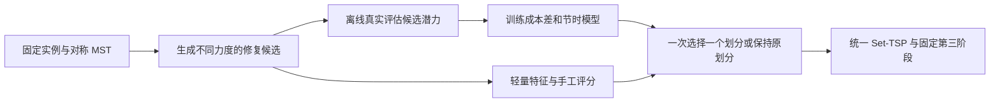

**MA-FSTSP 客户划分：历史尝试诊断与执行计划**

目标是在独立测试集上，相对对称 Set-MST，使第二阶段完整计算耗时总体减少至少 20%，最终配送成本总体增加不超过 5%，同时报告逐实例退化。先验证瓶颈和候选划分的改进空间，再决定学习模型负责的部分。

推荐研究主线：**生成不同修复力度的划分候选，预测相对初始划分的成本变化和节时收益，然后一次选择合适的划分。** 第三阶段保持为固定配送评价器。强化学习作为有证据支持多步决策价值后的扩展。

**1. 代码与历史证据边界**

历史代码为 `260831学习型尝试`，提交 `168914d`。当前开发分支 `260905学习型尝试2` 基于 `34ce513`。两者的 `src/fstsp.py`、`utils.py`、`problem.py`、`config.py`、`experiments.py`、`experiment_results.py` 无差异；旧分支主要增加独立的学习和评估模块。

证据来自 [0902 服务器目录](../results/服务器运行结果下载/260902学习型尝试（不含11k）results/learning)、训练检查点、训练历史、监督标签以及 360 行划分评估记录。360 行对应 60 个完整实例乘以 6 种方法，50/100/150 客户各 20 个实例。0902 目录没有完成的 11K 实验，不能据此判断 11K 泛化是否成功。

原始数据重算脚本为 [analyze_0902_attempt.py](../scripts/analyze_0902_attempt.py)，输出为 [branch_analysis.json](../results/learning/review_0902/branch_analysis.json)。历史计时包含求解结果缓存复用，以下百分比是记录重算，不是新的独立墙钟测试。

**2. 已经尝试了什么，失败证据支持到哪里**

| 已有方法 | 实际实现和结果 | 有依据的判断 | 尚未被否定的方向 |
|---|---|---|---|
| 对称 Set-MST | 显式合并双向距离，避免无向边被反向循环覆盖 | 适合作为统一基线；不是学习贡献 | 保留原始 MST 作附加对照 |
| 完全按人数均衡 | 强制各组达到 `floor/ceil(N/K)`，按仓库亲和力选择迁移客户 | 提速明显，但全规模均值成本均超出 5% | 部分均衡、按候选点负担均衡、保持小簇的迁移 |
| 多任务 MLP 代理 | 18 维组统计，成本、时间、超时任务，异方差和 Dropout | 粗粒度排序尚可，局部动作收益未验证可靠 | 面向同一实例的成本差、时间差学习 |
| 代理贪心 | 用该代理和成本主导奖励做少量 relocate/swap | 原配置不满足 20% 提速要求 | 改善候选覆盖和目标后的贪心；不能据此说贪心无效 |
| 单层 RL | 模仿代理教师，再进行 600 个 Actor-Critic episode | 未显示稳定提速 | 具有真实反馈、不同动作空间的 RL 尚未充分测试 |
| HRL | 上层选组、下层动作；同样 20 轮模仿、600 个 episode | 分层没有解决代理误判，也没有省掉全量动作预览 | 真正减少候选评估的分层策略，需要以后单独验证 |
| 真实求解复核 | 环境提供接口，但服务器训练预算为 0，正式评估策略阶段强制为 0 | 不能说已经验证过有真实反馈的训练 | 离线追加策略新状态标签、重新训练代理的闭环 |
| 大地图按需距离 | 有实现，本地曾有很小规模试验 | 属于运行支持能力 | 不能替代跨路网性能验证 |

相对对称 MST 的历史均值变化如下，正号表示增加：

| 方法 | 50 客户：时间 / 成本 | 100 客户：时间 / 成本 | 150 客户：时间 / 成本 |
|---|---:|---:|---:|
| 完全人数均衡 | −70.50% / +54.41% | −63.30% / +49.87% | −44.06% / +6.24% |
| 代理贪心 | +14.78% / −1.15% | −1.68% / +3.20% | +1.14% / +1.75% |
| 单层 RL | +22.87% / −0.43% | +0.72% / +4.81% | +1.35% / +3.62% |
| HRL | +14.20% / −1.03% | −1.58% / +2.16% | +1.05% / +3.17% |

这些结果否定的是表中的具体配置，不能外推成“均衡无效”“监督学习无效”或“强化学习无效”。新的研究不应仅换一个更大的网络，再重复同样的代理奖励和评价。

**3. 旧分支的关键缺点**

**3.1 扩大了策略训练，没有同步扩大真实监督。**

服务器指南建议约 1260 个单组样本，但实际 `linux-data-s0-v2` 仍是 195 行、15 个原始实例，训练/验证/测试为 9/3/3；每实例只有 3 个 relocate 和 1 个 swap。检查点确认代理最多训练 600 轮，实际第 35 轮最佳、第 95 轮早停。HRL 与单层 RL 确实完成了 20 轮模仿和 600 个 episode，但真实复核次数为零。

因此，600 个 episode 不是 600 次新的真实后续表现监督。继续增加同一代理上的训练轮数，并不补充模型缺失的知识。

**3.2 数据采样和在线动作选择的偏好还不一致。**

`168914d:src/learning/dataset.py:165` 主要按 `abs(affinity_delta)` 选归属接近的客户；`partition_env.py:544` 则首先按带符号的 `affinity_delta` 排序，更偏向预测几何代价降低的客户。在线又执行多步操作，离线标签只覆盖初始 MST 的一步邻域。两者造成额外分布偏移。

候选截断主要依赖客户到仓库的距离，没有保证保留“能显著减小困难组候选点负担”的动作。一个动作被候选生成器删掉后，再准确的评价模型也无法选择它。

**3.3 时间只在超预算后进入惩罚。**

`168914d:src/learning/partition_env.py:425` 的时间项在 20 秒以内为零，在 120 秒以上饱和。成本和风险不变时，19 秒降到 2 秒没有时间收益；甚至还会扣除移动惩罚。这与持续缩短第二阶段总时间的目标不一致。

**3.4 策略主要在优化自己的代理评分。**

模仿教师、RL 奖励、策略验证均依赖同一代理。`hierarchical_policy.py:266` 还屏蔽没有足够代理改善的仓库对和动作。被代理低估的好动作无法被正常探索，先退后进的调整路径也被排除。已有真实复核接口只回填结果缓存，没有形成自动追加训练样本并更新代理权重的完整闭环。

150 客户的 20 个真实评估实例中，HRL 的代理评分改善了 16 个，其中 13 个第二阶段记录时间反而增加；13/20 个实例的最大客户组还变大了。

**3.5 层次结构没有减少昂贵的候选预览。**

`hierarchical_policy.py:268` 每一步仍遍历所有仓库对并生成动作预测，再做上层掩码。`_swap_candidates` 还先枚举两组客户的全部组合，然后截断。这限制了层次结构的节省作用。

服务器 150 客户时，平均策略时间为代理贪心 2.506 秒、HRL 5.291 秒、单层 RL 5.903 秒。并且贪心使用默认 6 步、每方向 4 个迁移候选、每对 4 个交换候选；RL 检查点是 8 步、8/8 个候选。旧结果并非严格相同搜索预算下的策略结构消融。

**3.6 计时、统计验收和时间预测对象没有统一。**

- `evaluator.py:186` 在距离输入构造、后备 TSP 之后才开始记录第二阶段时间，漏掉实际开销；候选准备和模型构造的部分时间也不在合成的端到端指标中。
- `evaluation.py:259` 以组 P90 或超时率任一改善作性能通过条件，没有检查总时间减少 20%。50 客户 HRL 被标为通过，但平均第二阶段时间增加 14.2%。
- `surrogate.py` 对超时使用删失训练，却把超时观察值当作精确完成时间评价；`wall_time_mean` 反变换对数均值，未包含方差对期望的贡献。
- 缓存键缺少完整实例或候选集合上下文，无法区分同一客户组在不同全局客户集合下的候选区域变化。
- 0902 HRL 的客户组缓存命中数为 90/100、77/100、81/100。缓存可节省离线标签采集，但正式性能必须独立计时。

**4. 总体约束与逐实例约束产生不同研究结论**

对每个历史实例，只在已保存的六种方法中选择一种，并假设事先知道全部真实成本和记录时间，可以得到有限候选集合内的事后最好结果。

| 选择约束 | 50 客户时间变化 | 100 客户时间变化 | 150 客户时间变化 |
|---|---:|---:|---:|
| 每实例成本都不超过基线 5% | −15.37% | −7.96% | −4.63% |
| 同规模总体成本不超过基线 5% | −26.64% | −21.73% | −43.74% |

按用户接受的总体口径，将 60 个实例一起选择，总体时间可减少 39.23%，总体成本增加 4.998%。但有 24/60 个实例成本增加超过 5%，最大增加 68.09%。因此必须同时报告总体收益和个体退化，不能仅凭总体成本合格声称所有实例的配送质量都接近基线。

这个诊断只说明已保存候选具有互补性。它使用了真实答案和整个数据集的总成本预算，没有计算寻找全部候选的在线成本，并且受到旧计时与缓存口径限制，不能作为算法性能。旧 0902 实例已被用于研究诊断，不能再作为新方案的独立测试集。

由此得到的研究假设是：**在过度集中与完全均分之间，选择合适的修复力度，可能比一律执行同一种修复策略更有效。** 该假设需要在新实例上验证。

**5. 固定验收口径**

测试清单预先固定 50/100/150 三种规模的实例数量，主基线为对称 Set-MST，所有方法共用相同第二、三阶段实现、优化预算、线程数、随机种子、回退规则和距离语义。

设测试集实例为 r，最终配送成本为 C，第二阶段完整计算时间为 T₂：

`成本变化 = Σ C_new(r) / Σ C_MST(r) − 1 ≤ 5%`

`第二阶段节时率 = 1 − Σ T₂_new(r) / Σ T₂_MST(r) ≥ 20%`

采用总量之比，另报逐实例相对变化的均值、中位数和各规模结果，不混用两种统计。T₂ 包括组输入准备、MIP 建模、优化、顺序恢复以及实际执行的回退。所有仓库当前串行运行，因此使用各组时间之和。

另外报告第一阶段修复、特征提取、推理、模型加载和第三阶段时间，以及真实端到端墙钟时间。端到端不增加作为建议的工程检查；它不替代用户指定的第二阶段 20% 门槛。

逐实例附表至少给出成本增加超过 5% 的数量、最大恶化、时间变慢的数量和最差变慢；超时和无可行解回退不得从主结果中剔除。置信区间按完整实例配对重采样，并保留原有规模分层；邻域组和重复计时不是新增独立实例。

**6. 新方案的候选与选择机制**

候选不再只包含最多 8 次独立单客户移动，也不要求完全均分：

- 保持初始划分 `stay`。
- 人数均衡路径的部分前缀，例如完成该路径迁移量的 10%、25%、50%、75%；完全均衡保留为对照候选，不默认采用。
- 候选点负担驱动的部分修复。用客户边界节点数、平方和与变量规模估计筛出重组，再结合增加的仓库往返、组内连接和几何分散代价产生动作。
- 保持邻近小簇的迁移，先测试 2/4/8 个客户组成的连通小簇，避免强行拆散局部配送结构。
- 受控的 relocate/swap，用于比较旧动作空间与上述候选的覆盖差异。

首轮每实例最多保留 12 个不同候选划分，保持不同强度与类型的覆盖；全部评分方法共用同一候选集合和生成预算。后续是否增加候选数量，由“新增可行收益是否超过额外开销”决定。最初从 P₀ 生成候选并一次选择，暂不把预测误差累计到长轨迹中。

人数相同并不等于建模负担相同。若非空组有 q 个客户、客户边界集合大小为 b_c，则当前稠密实现创建的二元变量数为 `(q+1)² + 1 + Σ b_c² + (1+Σ b_c)²`，另有 `(q+1)²` 个连续流变量。该式可用于建模负担基线，但不是求解时间定理，仍需实测优化器搜索部分。

**7. 学习只在有收益空间时承担选择任务**

对固定初始划分 P₀ 与候选 P，离线记录：

`ΔC = C(P) − C(P₀)`，`ΔT₂ = T₂(P₀) − T₂(P)`。

优先直接预测候选相对基线的差值，减少两个大绝对预测相减造成的误差。输入只使用求解前可得的候选前后结构、差分和实例上下文；真实基线成本、真实求解时间、MIP gap 不作为在线输入。

首个监督模型分别预测成本差和节时，用树回归模型与小 MLP 对照。现有 [HistGradientBoostingRegressor](https://scikit-learn.org/stable/modules/generated/sklearn.ensemble.HistGradientBoostingRegressor.html) 支持绝对误差和分位数损失，可以用于点预测与保守成本估计。训练、早停和阈值选择按完整实例隔离，不使用估计器内部按行随机划分替代实例划分。

总体成本约束不必强制每个候选都通过单实例 5% 门槛。可在验证集上选择固定权衡参数 λ，使用 `预测节时 − λ × 预测成本增量` 选候选，同时保留风险校准和 `stay`。λ、修复力度和拒绝规则全部在最终测试前冻结，以验证集真实总体成本和时间选择，不在测试集事后分配成本额度。

若采用分位数保护，其作用是经验上的风险控制，不是逐实例保证。必须完整运行候选选择策略来校准所选候选的实际成本分布，不能仅评价随机单组的预测区间覆盖率。

模型主指标为同实例候选排序、收益符号、所选候选相对候选集最好方案的损失，以及真实总体成本—时间表现。全局相关系数仅作辅助。

“学习选择子问题或动作，保留既有求解器”的结构有相关研究先例，例如 [Learning to Delegate for Large-scale Vehicle Routing](https://arxiv.org/abs/2107.04139)。其车辆路径任务及收益不能直接作为本任务达标证据；本项目的贡献必须由相同候选和相同求解器下的比较支持。

**8. 分阶段执行与停止条件**

| 阶段 | 工作与规模 | 输出 | 进入下一阶段的条件 |
|---|---|---|---|
| A：完整计时与正确性 | 小型人工图验证；1K 上每规模 4 个新实例，共 12 个，完整测量三阶段 | 固定评价器、阶段时间表、复现清单 | 给定分区不被重新 MST 覆盖；成本与正常流程一致；阶段计时能解释总时间 |
| B：候选潜力与手工基线 | 1K 上每规模 10 个开发实例，共 30 个；最多 12 个候选，覆盖部分人数修复、候选负担修复和小簇迁移 | 候选成本—时间曲线、事后最好选择、手工规则表现 | 新计时口径下确认候选具有达到 20% 的空间；以约 30% 节时潜力作为给预测误差和开销留余量的建议目标 |
| C：监督式候选选择 | 通过 B 后，训练集逐步扩到 120 个原始实例、验证集 30 个；先用少量样本实测标签生成成本 | 成本差模型、时间差模型、固定选择规则及消融 | 相同候选和开销预算下，学习选择优于强手工规则，并在验证集满足目标 |
| D：独立验收 | 每规模 30 个全新测试实例，共 90 个；固定方法，优化器种子匹配，方法执行顺序交替；噪声敏感病例做重复计时 | 总体指标、分规模和逐实例附表、配对置信区间 | 总体成本增加不超过 5%，完整 T₂ 减少至少 20%；如区间仍跨越门槛，结论保留不确定性 |
| E：泛化与必要扩展 | 1K 达标后再做 NYC 11K 小规模递增；另行选择真正不同路网 | 泛化边界、重新校准需求 | 基础候选和评价器稳定后，才考虑 GNN、少量多步搜索或 RL |

阶段 B 的开发实例不能进入阶段 D。历史 0902 数据可帮助定位失败模式和选择诊断范围，不作为最终独立测试。

标签采集先用少量实例估计：每个候选需要新增评估哪些组、每组第二和第三阶段时间、重复计时成本。先估算再扩大，不能把“120 个原始实例”误报成轻量训练任务；主要成本在真实标签生成。

停止或调整方向的规则：

- 若新计时显示第二阶段主要负担来自输入和建模，先让候选负担修复和建模规模特征承担主作用；如主要来自 MIP 搜索，重点补充同规模但距离结构不同的标签。
- 若候选事后最好选择也达不到 20%，先改进候选集合；扩大网络不能创造候选里不存在的划分。
- 若事后选择有效而模型选择无效，补充错误选择、新修复状态和相近规模样本，调整输入及差值训练；不要直接扩大 RL。
- 若手工方法已经达标而学习没有增益，保留手工方法作为结果，学习的职责可转向难实例识别或修复力度选择；不预设必须得到学习创新。
- 若一阶段提速不足且候选改进空间有限，再单独评估第二阶段工程优化；同一工程优化须施加到所有划分方法，避免把求解器修改的收益归因于学习。

**9. 评价器与数据实现约定**

固定第二、三阶段数学语义，先使用共同的 30 秒优化预算做与历史接近的诊断；这不等于整个第二阶段只有 30 秒。若阶段 A 表明该预算导致大量截断、无法分辨难度，再在开发集上选定新的共同预算，正式比较前冻结。预算调整的效果不得计为学习划分收益。

首个时间标签选择“固定预算和回退策略下的实际完整运行开销”。超时仍是该部署策略的真实观测结果，另存超时和解质量字段；不同时声称预测了不限时完成时间。第三阶段固定执行，超长任务的监督采集可终止并标记未完成，不把中断时间伪装成完整成本标签。

建议数据分成三张表：

- `instances`：完整客户/仓库、地图和距离语义、候选集合上下文、参数、实例划分、源码与求解器版本。
- `group_runs`：仓库、稳定排序客户、候选指纹、输入/建模/优化/恢复/回退/DP 时间、成本、状态、预算、种子、重复编号。
- `partition_candidates`：初始分区、完整候选分区、修复类型和力度、改变的仓库、真实 ΔC/ΔT₂、提取特征和选择结果。

单客户迁移或交换只改变两组；部分均衡路径可能改变多个组，应重算所有改变的组，不能一律套用“两组增量”。固定实例中的全局边界集合和第三阶段区域保持一致，使未改变组可在离线标签阶段复用。

真实标签缓存键必须覆盖完整实例或候选集合指纹、组成员、求解和车辆参数、距离规则、版本与种子。正式性能测试禁用直接返回已求解结果的缓存，以实际开始结束时钟计时；道路最短路缓存明确采用相同冷/暖策略。模型常驻与冷加载分开报告。

**10. 当前分支的模块安排**

下列是待实现职责，不是已经存在的训练命令：

| 模块 | 职责 | 旧分支可借鉴部分 |
|---|---|---|
| `src/partition_repair/evaluator.py` | 固定给定分区，返回完整时间、成本与状态 | 单组评价器和遥测字段，修正计时与缓存上下文 |
| `src/partition_repair/candidates.py` | 生成不同修复类型、力度和保持原分区的候选 | 显式对称 MST、客户守恒操作、人数均衡路径 |
| `src/partition_repair/features.py` | 可提前取得的候选前后负担和结构特征 | 18 维组特征作为基础，增加差分和实例上下文 |
| `src/partition_repair/selector.py` | 相同候选上的手工或监督式一次选择 | 保留统一调用接口，重新定义目标与停止规则 |
| 独立采集、训练、评估脚本 | 实例清单、分区标签、模型与公平验证 | 借鉴文件结构，采用新指标和隔离的结果目录 |

原 `solve()` 和 `experiment_results._solve_model_with_process_data()` 都要接入显式的分区选择入口。给定候选分区的评价不能调用会重做 MST 的完整求解入口。旧代理和策略权重仅作历史对照，不默认作为新流程的初始化或教师。

必要的新测试覆盖：给定分区不被覆盖、正常流程与固定分区评价的成本一致、部分修复的客户守恒、所有改变组的增量与整实例重算一致、完整计时边界、缓存上下文，以及总体成本约束和逐实例统计的区别。中文函数说明和关键变量注释随实现提供。

当前最先实施的交付是阶段 A 与 B：**完整评价器、受控候选生成器和 30 个开发实例的候选潜力报告。** 达到进入条件后再开展监督学习。
